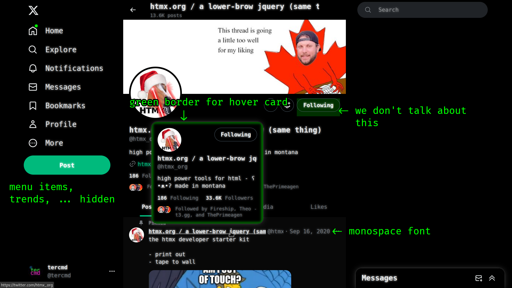

# Twitter

A theme for Twitter.com that makes it greener, removes trends and unwanted menu items, marks ads with a light green background.

Config:
- Set theme to dark
- Set display color to green in Twitter settings.

(The screenshots use Fira Code as the monospace font)